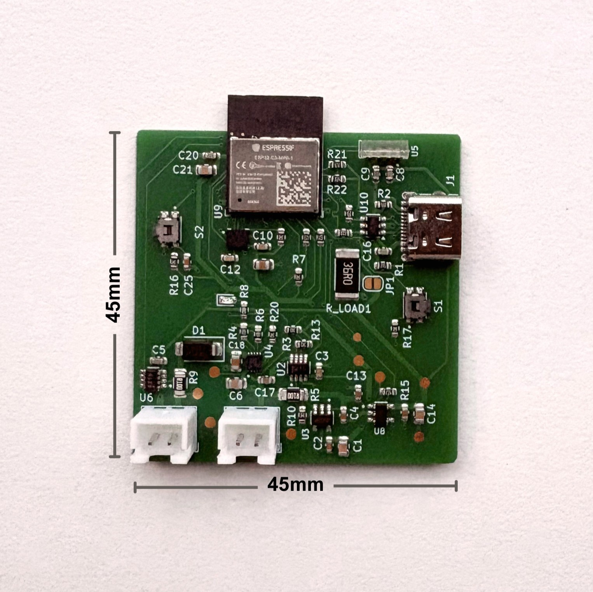
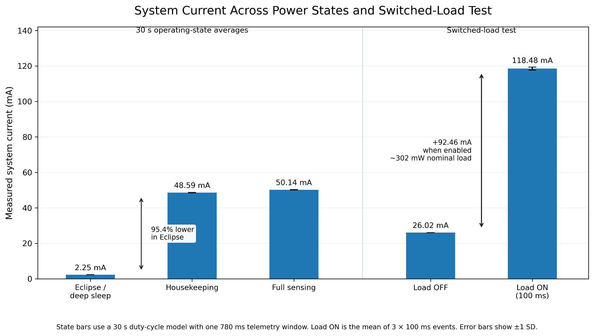
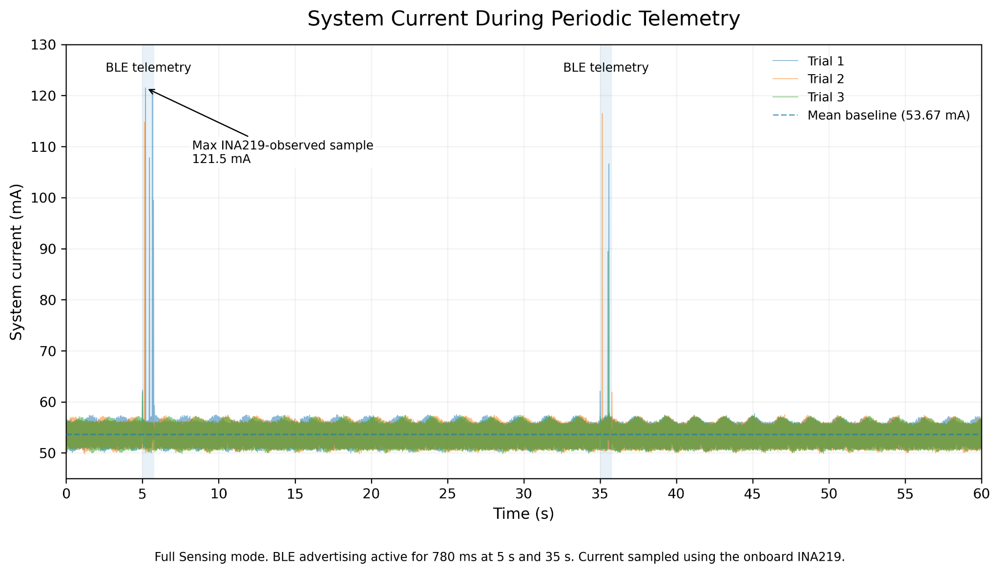
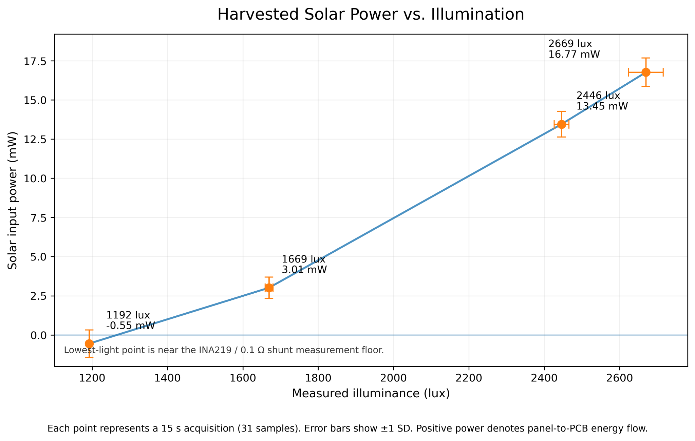

# ChipSat v1: Solar-Powered CubeSat Power Testbed

ChipSat v1 is a custom 45mm x 45mm PCB I built to test how firmware power-management decisions affect the actual current draw of a small satellite-style system. It was developed alongside my power budget work for the Duke Solar Sail project.

<p align="center">
  
</p>

## What this is

The goal was not to reproduce flight hardware exactly. Instead, I wanted a physical testbed where I could keep the hardware fixed and measure how much the power draw changed as I switched between different firmware schedules.

The board includes:

* ESP32-C3-MINI-1 MCU with native USB
* Solar input and Li-ion charging using the BQ25185
* Two INA219 current and voltage monitors: one on the solar input and one on the main system rail
* ICM-42688-P 6-axis IMU over SPI
* VEML7700 ambient light sensor
* Switchable `+3V3_SENS` rail for the sensor domain
* 36Ω switched load behind a solder jumper to emulate an approximately 300mW ADCS load, comparable to a single magnetorquer actuation
* BLE telemetry using the ESP32-C3 radio as a stand-in for LoRa downlink. I kept the same 780ms transmission window and cadence used in the mission power model (and without attempting to reproduce LoRa RF behavior)

## Repo layout

```text
hardware/         KiCad project: schematic, PCB layout, design rules
manufacturing/    Gerbers, drill files, pick-and-place, fab submission files
images/           Board photos and test figures
docs/             BOM
```

## Firmware power states

| State         | MCU                       | IMU | +3V3_SENS | BLE proxy                           | Mission interpretation                                   |
| ------------- | ------------------------- | --- | --------- | ----------------------------------- | -------------------------------------------------------- |
| Eclipse sleep | Deep sleep between events | Off | Off       | Wake every 30s, advertise for 0.78s | Earth-shadow stress case with nominal telemetry retained |
| Housekeeping  | Active                    | Off | Off       | 0.78s every 30s                     | Scheduling and health checks                             |
| Full sensing  | Active                    | On  | On        | 0.78s every 30s                     | Complete sensing window                                  |

## Results

### Power-state testing

Deep sleep reduced average current by 95.4%.

Each state was run over a representative 30s cycle:

* Eclipse sleep: 2.25mA
* Housekeeping: 48.59 ± 0.10mA
* Full sensing: 50.14 ± 0.11mA

I also tested the switched 36Ω load used to emulate an ADCS event. System current increased from a 26.02mA baseline to 118.48 ± 0.87mA with the load enabled, close to the expected result for an approximately 300mW resistive load.

<p align="center">
  
</p>

### BLE telemetry

I held the board in Full Sensing for 60s and enabled BLE advertising for 780ms every 30s.

Across three trials, the baseline stayed at 53.67 ± 0.10mA. During the advertising windows, the INA219 measured short peaks up to 121.5mA.

At this cadence, the radio is active for roughly 2.6% of the cycle. The test helped confirm that the BLE event appears as a short current spike rather than setting the power draw for the full operating period.

<p align="center">
  
</p>

### Solar harvesting

I used the solar-side INA219 together with the VEML7700 to compare harvested power against measured illuminance.

Harvested power increased from 3.01 ± 0.68mW at about 1669 lux to 16.77 ± 0.91mW at about 2669 lux.

The lowest-light measurement is close to the practical measurement floor of the INA219 with the 0.1Ω shunt, so that point has noticeably more variation than the higher-light measurements.

<p align="center">
  
</p>

## Bring-up notes

A few issues from bring-up ended up being especially useful:

### I2C bus switching

The ESP32-C3 only has one I2C controller, while the board uses two physical I2C buses. Firmware therefore remaps the controller depending on which bus is being accessed.

One issue appeared when I disabled the sensor rail before an I2C transaction had fully completed. This could leave SDA or SCL in the wrong state and break later communication. I fixed it by completing the transaction and releasing the bus before switching off `+3V3_SENS`.

### Low-current measurement floor

Under weak illumination, the solar current became small enough that the INA219 and 0.1Ω shunt were operating near their useful measurement limit. At that point, offset and resolution were large enough for the reported current to occasionally drift around zero.

I kept the data rather than filtering it out, but marked the lowest-light point as being close to the measurement floor.

### BLE stack overhead

One result I did not initially expect was the cost of simply initializing BLE.

Even with advertising disabled, bringing up the BLE stack raised the active current noticeably. Because of this, "advertising off" and "BLE fully deinitialized" are separate power states in the firmware rather than being treated as equivalent.

## Manufacturing

Gerbers, drill files, and the original fab submission files for the 2-layer PCB are included in [`manufacturing/`](manufacturing/).

The KiCad project is the source of truth. If you need outputs for a different board house, regenerate them from:

`hardware/chipsat_v1.kicad_pcb`

## BOM

The full bill of materials, including LCSC part numbers, is available at [`docs/BOM.csv`](docs/BOM.csv).

## Opening the project

KiCad 8 or newer is recommended.

Open:

`hardware/chipsat_v1.kicad_pro`

## License

MIT. See [LICENSE](LICENSE).

The hardware design files are included for reference and reuse. If you build directly on the board design, credit back to this repo is appreciated.
